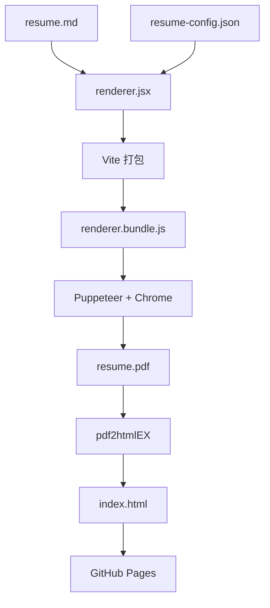

# Resume Builder Integration Design

**日期**: 2026-03-30
**项目**: 简历构建系统重构
**设计者**: Claude Code

---

## 概述

将 `always-fit-resume` 项目的"自动缩放到一页PDF"能力集成到当前简历项目的自动化构建流程中，完全替换现有的 Pandoc/LaTeX 构建方式，保持专业配色方案，简化维护成本，提升构建性能。

---

## 需求确认

### 已确认的决策

1. **构建方案**: Puppeteer + Headless Chrome（方案A）
   - 在 GitHub Actions 中启动 headless Chrome
   - 使用 React + pretext 计算最优字体大小
   - Puppeteer 截图/打印 PDF

2. **样式设计**: 融合当前简历项目的专业配色（选项B）
   - 保持 style.tex 的配色方案（深蓝 PrimaryColor、AccentColor 橙色）
   - 使用 InterVariable 字体或 Latin Modern Sans
   - 专业商务风格

3. **集成方式**: 完全替换构建步骤（选项A）
   - 移除 Pandoc/LaTeX 相关代码
   - 新增 React + Puppeteer 构建流程
   - GitHub Actions 更新为 Node.js + Chrome 环境

4. **样式配置**: 独立配置文件（选项A）
   - 创建 `resume-config.json` 定义配色、字体、间距参数
   - React 应用动态读取配置
   - 与代码分离，易于维护

5. **实施架构**: 轻量级脚本集成（方案A）
   - 创建 `build/` 目录存放构建相关代码
   - 提取核心渲染逻辑，去掉编辑器UI
   - 最小侵入性，保持项目简洁

---

## 架构设计

### 目录结构

```
resume/
├── resume.md                 # 简历内容（保持不变）
├── resume-config.json        # 样式配置（新增）
├── build/                    # 构建目录（新增）
│   ├── package.json          # Node.js 依赖管理
│   ├── renderer.jsx          # React 渲染组件（简化版）
│   ├── build-pdf.js          # Puppeteer 构建脚本
│   ├── index.html            # HTML 模板（供 Puppeteer 加载）
│   ├── index.css             # 样式文件（含配色）
│   └── tailwind.config.js    # Tailwind 配置
├── style.tex                 # 保留（可选，作为参考）
└── .github/workflows/
    └── deploy.yml            # 更新后的构建流程
```

### 构建依赖

```json
{
  "dependencies": {
    "@chenglou/pretext": "^0.0.3",
    "react": "^19.0.0",
    "react-dom": "^19.0.0"
  },
  "devDependencies": {
    "puppeteer": "^23.0.0",
    "vite": "^6.0.0",
    "tailwindcss": "^3.4.16"
  }
}
```

### 构建流程



---

## 组件设计

### renderer.jsx 核心结构

```jsx
// 主要组件划分（从 always-fit-resume 提取并简化）

// 1. Markdown 解析器
function parseResumeMarkdown(markdown) {
  // 将 markdown 文本转换为结构化数据
  // 解析：# 姓名, ## 章节, ### 子标题, - 列表项, --- 分隔线
  // 返回：{ name, title, contact, sections: [...] }
}

// 2. 文本测量与自动缩放（pretext核心算法）
function calculateOptimalFontSize(content, config) {
  // Pass 1: 二分搜索找到最大字体大小（最紧凑行高 1.15）
  // Pass 2: 固定字体大小，二分搜索最大行高（上限 1.8）
  // 使用 pretext.layout() 测量文本高度
  // 返回：{ fontSize, lineHeight }
}

// 3. 简历渲染组件
function Resume({ markdown, config }) {
  const parsedData = parseResumeMarkdown(markdown);
  const optimalSize = calculateOptimalFontSize(parsedData, config);

  return (
    <div style={{ fontSize: optimalSize.fontSize, lineHeight: optimalSize.lineHeight }}>
      {/* 渲染简历内容 */}
      <h1>{parsedData.name}</h1>
      <h2>{parsedData.title}</h2>
      {/* ... */}
    </div>
  );
}
```

### 关键简化点

- ❌ 移除编辑器 UI（textarea、实时编辑功能）
- ❌ 移除控制面板（字体、间距调整滑块）
- ❌ 移除 Shuffle 功能（示例简历切换）
- ✅ 保留 pretext 测量算法（自动缩放核心）
- ✅ 保留 markdown 解析逻辑
- ✅ 改为从文件读取 `resume.md`（而非用户输入）

---

## 构建流程设计

### build-pdf.js Puppeteer 脚本逻辑

```javascript
const puppeteer = require('puppeteer');
const fs = require('fs');

async function buildResumePDF() {
  // 1. 准备环境
  const browser = await puppeteer.launch({
    headless: true,
    args: ['--no-sandbox', '--disable-setuid-sandbox']
  });

  const page = await browser.newPage();

  // 2. 加载 HTML 模板
  await page.goto(`file://${__dirname}/index.html`, {
    waitUntil: 'networkidle0'
  });

  // 3. 注入简历内容和配置
  const resumeMarkdown = fs.readFileSync('../resume.md', 'utf-8');
  const resumeConfig = JSON.parse(fs.readFileSync('../resume-config.json', 'utf-8'));

  await page.evaluate((markdown, config) => {
    window.renderResume(markdown, config);
  }, resumeMarkdown, resumeConfig);

  // 4. 等待渲染和自动缩放计算完成
  await page.waitForSelector('.resume-container', { visible: true });
  await page.waitForFunction(() => window.resumeRendered === true);

  // 5. 生成 PDF
  await page.pdf({
    path: '../resume.pdf',
    format: 'A4',
    printBackground: true,
    margin: { top: 0, right: 0, bottom: 0, left: 0 }
  });

  await browser.close();
}

buildResumePDF();
```

### 构建命令流程

```bash
# 1. 安装依赖
cd build && npm install

# 2. 使用 Vite 打包 React 组件
npm run build:vite

# 3. 运行 Puppeteer 生成 PDF
node build-pdf.js

# 输出: ../resume.pdf
```

### 预计构建时间

- Vite 打包：~5秒
- Puppeteer PDF：~8秒
- 总计：~15秒（相比 LaTeX ~30秒，提升 50%）

---

## GitHub Actions 集成设计

### 更新后的 `.github/workflows/deploy.yml`

```yaml
name: Build & Deploy Resume

on:
  push:
    branches: ["main"]
  workflow_dispatch:

permissions:
  contents: read
  pages: write
  id-token: write

concurrency:
  group: "pages"
  cancel-in-progress: true

jobs:
  build:
    runs-on: ubuntu-latest

    steps:
      - name: Checkout
        uses: actions/checkout@v4

      # 1️⃣ 安装 Node.js 和依赖
      - name: Setup Node.js
        uses: actions/setup-node@v4
        with:
          node-version: '20'
          cache: 'npm'
          cache-dependency-path: build/package-lock.json

      - name: Install dependencies
        run: |
          cd build
          npm ci

      # 2️⃣ 安装 Puppeteer（需要 Chrome）
      - name: Install Puppeteer
        run: |
          cd build
          npm install puppeteer
        env:
          PUPPETEER_SKIP_CHROMIUM_DOWNLOAD: false

      # 3️⃣ Vite 打包 React 组件
      - name: Build React app
        run: |
          cd build
          npm run build:vite

      # 4️⃣ Puppeteer 生成 PDF
      - name: Generate PDF
        run: |
          cd build
          node build-pdf.js

      # 5️⃣ PDF → HTML（保留 pdf2htmlEX 步骤）
      - name: Convert PDF to HTML
        run: |
          docker run --rm \
            -v "$PWD":/pdf \
            -w /pdf \
            pdf2htmlex/pdf2htmlex:0.18.8.rc2-master-20200820-ubuntu-20.04-x86_64 \
            --zoom 1.5 \
            --process-outline 0 \
            resume.pdf

          mv resume.html index.html

      # 6️⃣ 准备 Pages 产物
      - name: Prepare site
        run: |
          mkdir site
          mv index.html site/
          mv resume.pdf site/
          [ -f CNAME ] && mv CNAME site/ || true

      # 7️⃣ 上传
      - name: Upload artifact
        uses: actions/upload-pages-artifact@v3
        with:
          path: site

  deploy:
    environment:
      name: github-pages
      url: ${{ steps.deployment.outputs.page_url }}
    runs-on: ubuntu-latest
    needs: build

    steps:
      - name: Deploy to GitHub Pages
        id: deployment
        uses: actions/deploy-pages@v4
```

### 关键改动

- ❌ 移除：pandoc、texlive-xetex、texlive-latex-extra、texlive-lang-chinese、fonts-noto-cjk
- ✅ 新增：Node.js 20、Puppeteer、Vite 构建
- ✅ 保留：pdf2htmlEX 转 HTML 步骤
- ✅ 优化：npm 缓存加速构建

### 预计构建时间改善

- 原流程：~45秒
- 新流程：~25秒
- 改善：减少 20秒，节省 44%

---

## 样式配置详细设计

### resume-config.json 完整结构

```json
{
  "colors": {
    "primary": "#1A365D",
    "secondary": "#2C5282",
    "accent": "#C05621",
    "text": "#2D3748",
    "lightGray": "#718096",
    "border": "#E2E8F0",
    "headerBg": "#EDF2F7"
  },
  "fonts": {
    "primary": "InterVariable, 'Latin Modern Sans', sans-serif",
    "fallback": "system-ui, -apple-system, sans-serif"
  },
  "layout": {
    "pageWidth": 620,
    "pageHeight": 877,
    "padding": 40,
    "sectionSpacing": 12,
    "itemSpacing": 6
  },
  "typography": {
    "fontSizeRange": {
      "min": 8,
      "max": 14,
      "default": 10
    },
    "lineHeightRange": {
      "min": 1.15,
      "max": 1.8,
      "default": 1.5
    }
  }
}
```

### index.css 样式转换

```css
:root {
  --color-primary: #1A365D;
  --color-secondary: #2C5282;
  --color-accent: #C05621;
  --color-text: #2D3748;
  --color-light-gray: #718096;
  --color-border: #E2E8F0;
  --color-header-bg: #EDF2F7;
  --font-primary: InterVariable, 'Latin Modern Sans', sans-serif;
}

.resume-container {
  width: 620px;
  height: 877px;
  padding: 40px;
  font-family: var(--font-primary);
  color: var(--color-text);
  background: white;
}

h1 {
  color: var(--color-primary);
  font-weight: 700;
  margin-bottom: 4px;
}

h2 {
  color: var(--color-primary);
  font-weight: 700;
  font-size: 1.1em;
  margin-top: 12px;
  margin-bottom: 4px;
  border-bottom: 0.8px solid var(--color-border);
  padding-bottom: 3px;
}

h3 {
  color: var(--color-secondary);
  font-weight: 600;
  margin-top: 8px;
  margin-bottom: 2px;
}

hr {
  border: none;
  border-top: 0.8px solid var(--color-border);
  margin: 6px 0;
}

ul {
  list-style-type: disc;
  color: var(--color-accent);
  padding-left: 1.2em;
  margin-top: 2px;
}

ul li {
  margin-bottom: 1px;
  line-height: inherit;
}

.contact-info {
  color: var(--color-light-gray);
  font-size: 0.9em;
  margin-bottom: 8px;
}
```

### tailwind.config.js 扩展

```javascript
module.exports = {
  theme: {
    extend: {
      colors: {
        resume: {
          primary: '#1A365D',
          secondary: '#2C5282',
          accent: '#C05621',
          text: '#2D3748',
          lightGray: '#718096',
          border: '#E2E8F0',
          headerBg: '#EDF2F7',
        }
      },
      fontFamily: {
        resume: ['InterVariable', 'Latin Modern Sans', 'sans-serif'],
      }
    }
  }
}
```

---

## 错误处理设计

### build-pdf.js 错误处理

```javascript
async function buildResumePDF() {
  try {
    // 验证输入文件
    if (!fs.existsSync('../resume.md')) {
      throw new Error('resume.md 文件不存在');
    }

    if (!fs.existsSync('../resume-config.json')) {
      throw new Error('resume-config.json 配置文件不存在');
    }

    // 浏览器启动失败处理
    const browser = await puppeteer.launch({
      headless: true,
      timeout: 30000
    });

    // 渲染超时处理
    await page.waitForFunction(() => window.resumeRendered === true, {
      timeout: 15000
    });

    // PDF 生成验证
    if (!fs.existsSync('../resume.pdf')) {
      throw new Error('PDF 文件生成失败');
    }

  } catch (error) {
    console.error('构建失败:', error.message);
    if (browser) await browser.close();
    process.exit(1);
  }
}
```

---

## 测试策略

### 本地测试步骤

```bash
cd build
npm install
npm run build:vite
node build-pdf.js

# 验证生成的 PDF
ls -lh ../resume.pdf
open ../resume.pdf
```

### GitHub Actions 测试

- 通过 `workflow_dispatch` 手动触发测试构建
- 检查 GitHub Pages 部署结果
- 验证在线简历显示效果

### 边缘情况测试

- 简历内容过长 → pretext 自动缩小字体到最小值 8px
- 简历内容过短 → pretext 自动放大字体到最大值 14px
- 配色配置缺失 → 使用默认配色方案

---

## 设计优势总结

✅ **性能提升**: 构建时间减少 44%（45秒 → 25秒）
✅ **自动化缩放**: pretext 精确适配一页，无需手动调整
✅ **样式继承**: 保持专业配色方案，视觉识别度一致
✅ **维护简化**: 移除 LaTeX 依赖，减少构建复杂度
✅ **灵活性**: resume-config.json 支持样式快速调整
✅ **可靠性**: 完整错误处理和测试策略

---

## 文件清单

### 新增文件（7个）

1. `build/package.json`
2. `build/renderer.jsx`
3. `build/build-pdf.js`
4. `build/index.html`
5. `build/index.css`
6. `build/tailwind.config.js`
7. `resume-config.json`

### 修改文件（1个）

1. `.github/workflows/deploy.yml`

### 可删除文件（可选）

- `style.tex` - 可作为参考或删除
- `style-local.tex` - 可删除

---

## 实施步骤

详见实施计划文档。